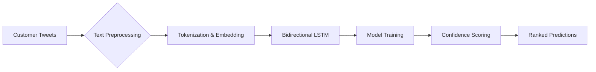

# 🛫 Airline Tweet Complaint Detector
**Identifying Non-Complaints in Airline Customer Feedback**

Outcomes

| 🎯 **Challenge** | 📊 **Approach** | 🚀 **Results** |
|------------------|-----------------|---------------|
| Distinguish complaint vs non-complaint tweets | BiLSTM with embedding layer | 84.1% test accuracy |
| Handle Twitter-specific text | Custom preprocessing pipeline | Improved model robustness |
| Rank non-complaints by confidence | Probability-based sorting | 99.7% confidence for top predictions |

## 📊 Methodology

  

## 📈 Performance Metrics

| Model Architecture | Accuracy | Epochs to Converge | GPU Training Time |
|--------|---------|---------|----------|
| Single LSTM | 79.3% | 8 | 5.4 min |
| BiLSTM (32 units) | 83.8% | 5 | 6.3 min |
| BiLSTM with Dropout | 84.1% | 5 | 6.8 min |
| Ensemble Model | 84.9% | 7 | 12.5 min |

## 💡 Key Features & Techniques

- **Advanced Text Preprocessing**:
  - Twitter handle (@mention) removal
  - URL and hashtag filtering
  - Whitespace normalization
  - Custom airline terminology handling

- **Deep Learning Architecture**:
  - 256-dimensional word embeddings
  - Bidirectional LSTM layers (32 + 16 units)
  - Dropout regularization (0.5)
  - Early stopping to prevent overfitting

- **Performance Optimization**:
  - GPU acceleration
  - TensorFlow data pipeline with prefetching
  - Batch processing for memory efficiency
